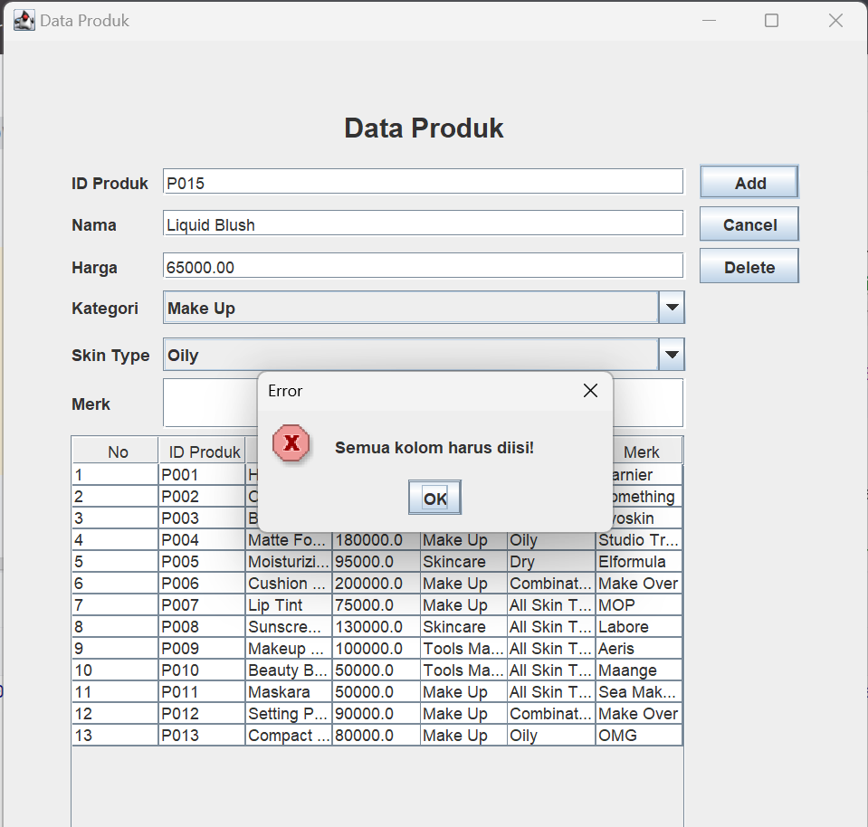
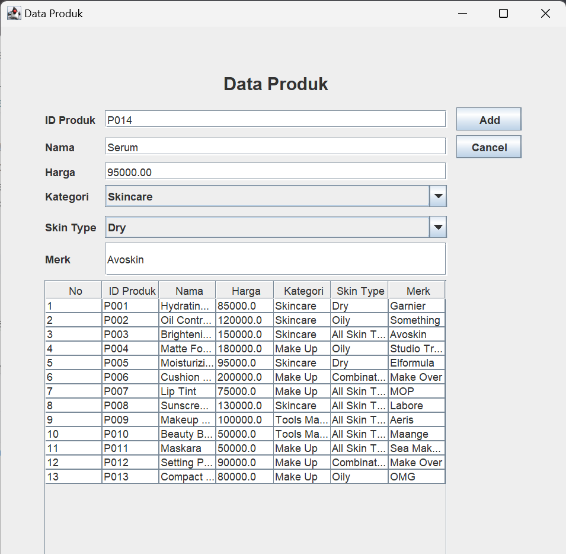
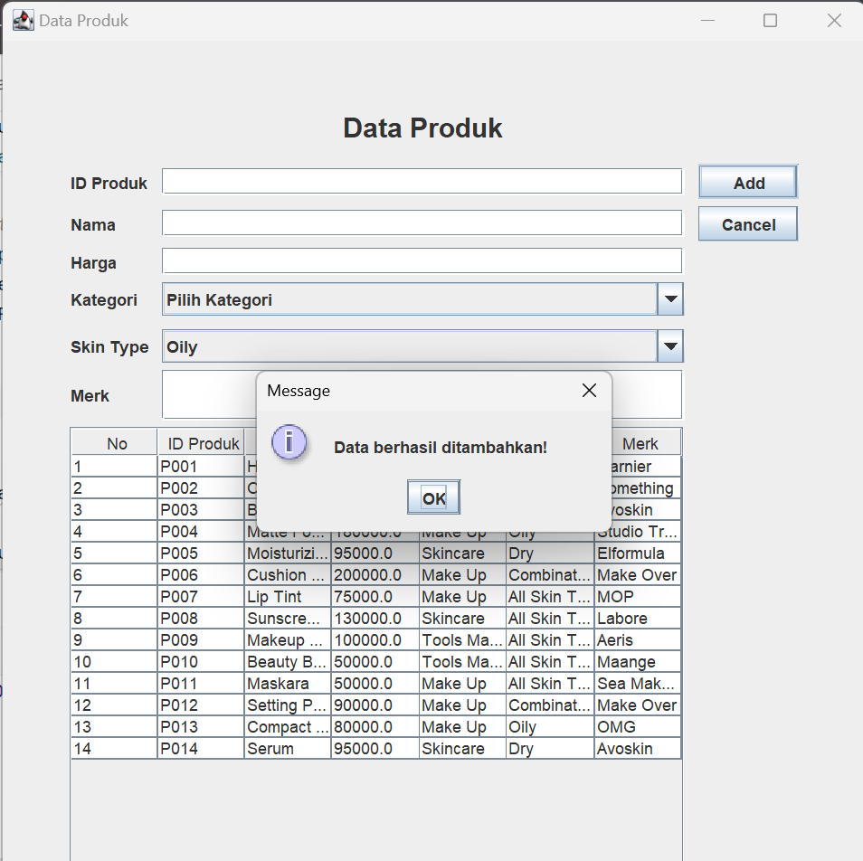
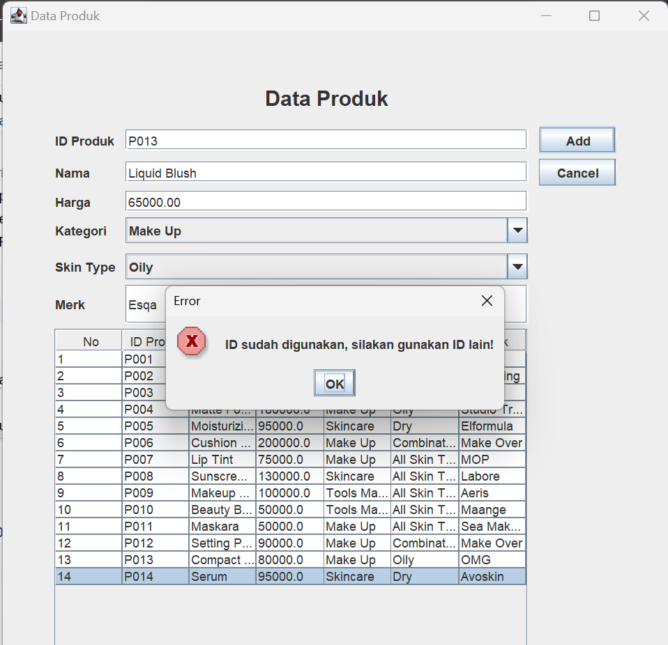
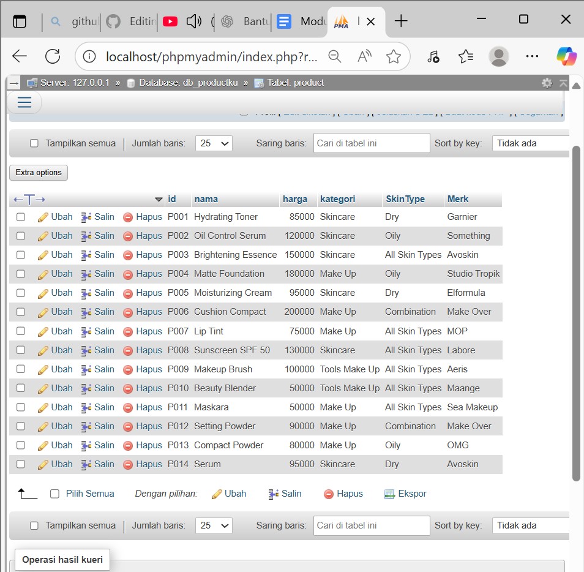
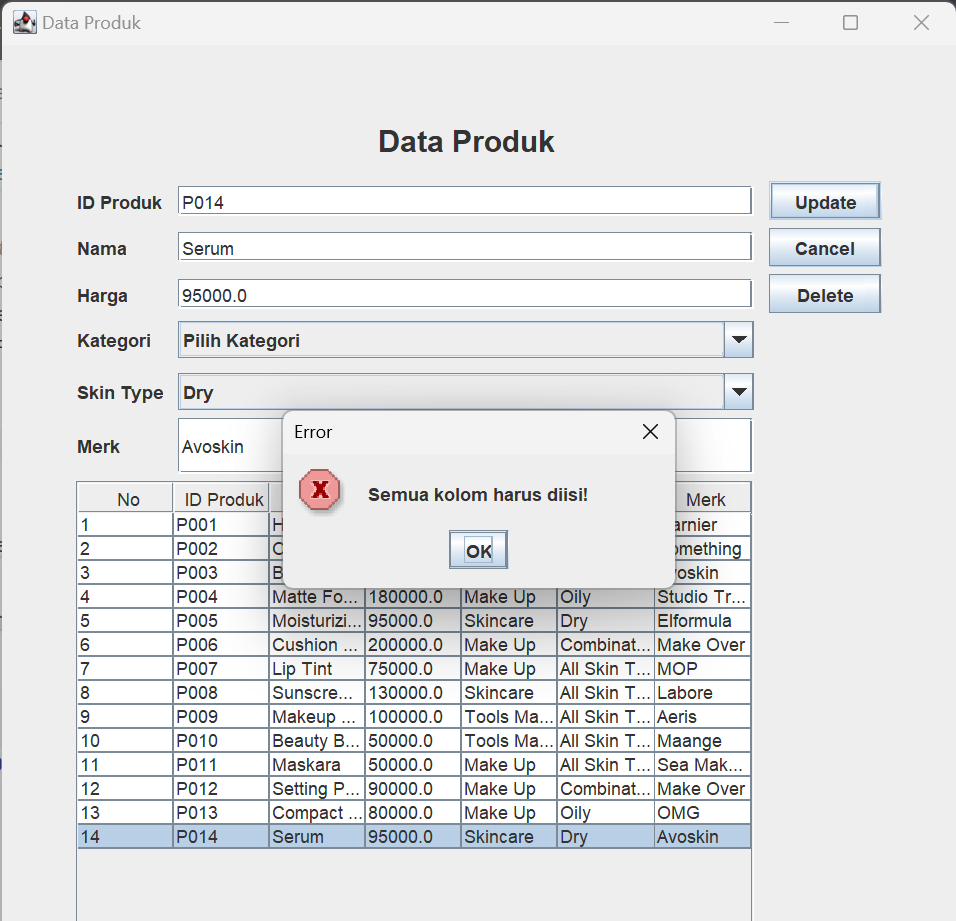
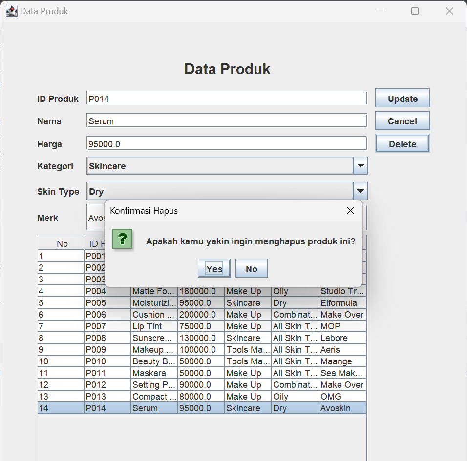
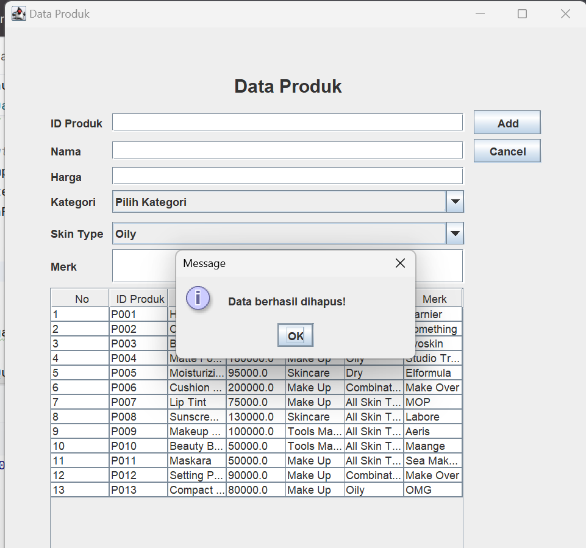
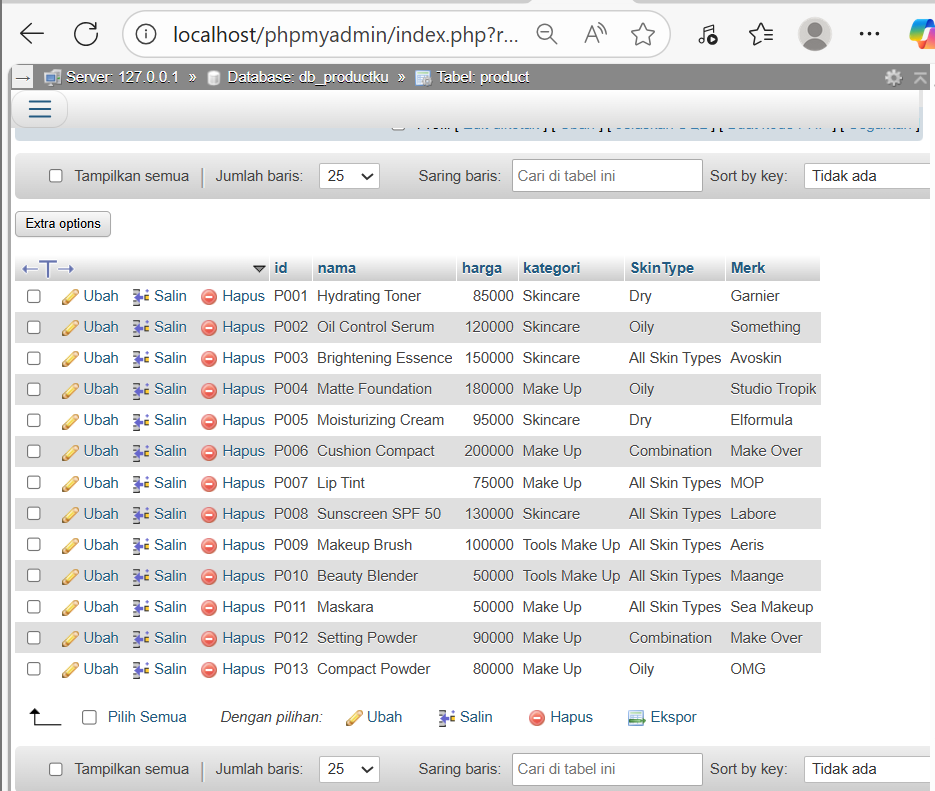

# TP5DPBO2425C2
Saya Fauzia Rahma Nisa mengerjakan Tugas Praktikum 5 dalam mata kuliah Desain dan Pemrograman Berdasarkan Objek untuk keberkahanNya maka saya tidak melakukan kecurangan seperti yang telah dispesifikasikan. Aamiin.

**1. Desain Program**
**2. Penjelasan Alur**
**3. Dokumentasi**
   
   **A. ADD**
   
   
   
   
   
   

   **B. Update**
   

   
   **C. Delete**
   
   
   
